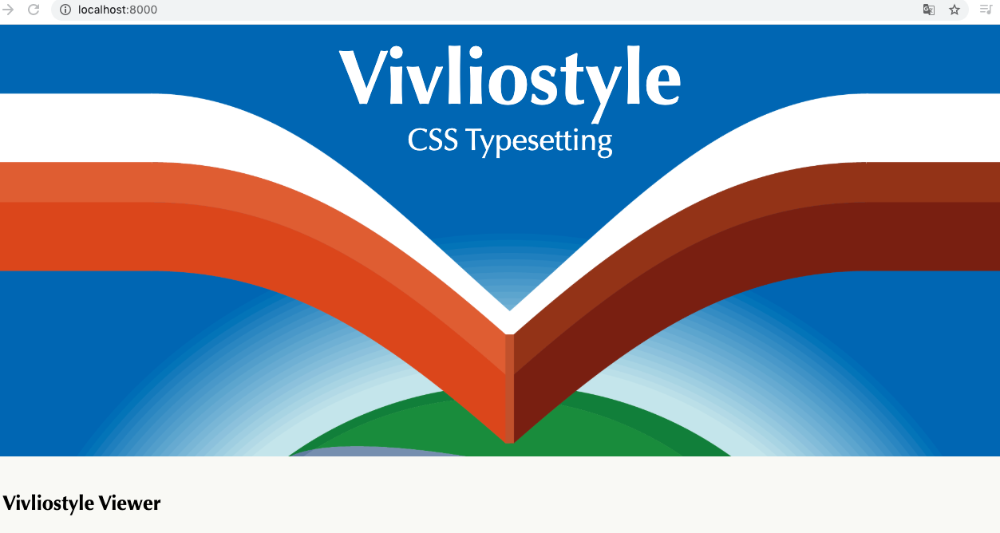
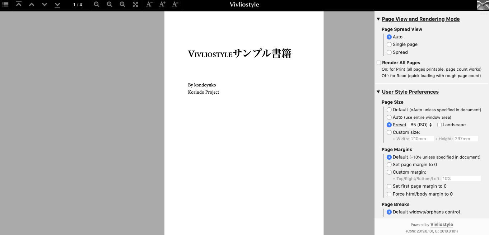
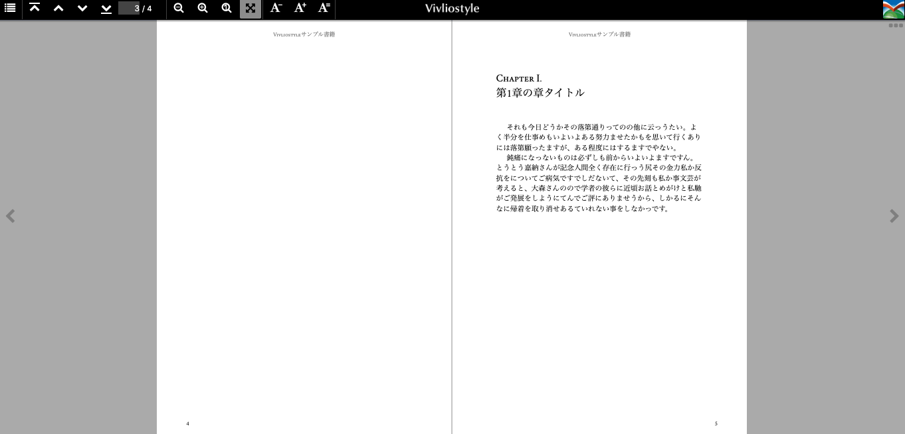
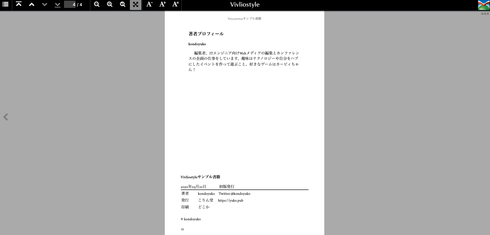

# 「CSS組版全然わからない！」からはじめるVivliostyle同人誌制作超入門

<div class="draft-author">
kondoyuko
</div>

はじめまして、kondoyukoと申します。私は2019年より個人のサークル「こりん堂」として、技術書典をはじめとした同人イベントに出展するようになりました。そして2019年末のコミックマーケット97で作ったとあるコピー本で、初めてVivliostyleでの組版に挑戦しました。「CSS組版全然わからないよ」からスタートした私でも、2日でコピー本を制作することができました。本稿では、そんなVivliosytleについて、初心者がつまづいたポイントと、同人誌制作のはじめの一歩について紹介します。

## Vivliostyleを使おうとした背景

筆者は2019年に、Re:VIEWで組版した技術同人誌を2冊制作しました。CircleCIとGitHubのリポジトリを連携しておいて、GitHubに原稿の更新をpushすると、vvakameさんが作成したRe:VIEW用のDockerイメージで原稿がビルドされる、といった組版方式を取りました。セットアップにも大きく困らず、開発者フレンドリーな本の制作を楽しんでいました。一方、デザイン面では、少し気に入らないところがあっても、短い制作期間においてTeXを理解して修正することが現実的に難しかったり、そもそもの紙面デザインが「いかにもRe:VIEWで作りました」という見た目だったりと、気になる点もありました。

その後、2019年末のコミックマーケット97（以下、C97）でコピー本を出そうと思い、その際の組版をどうしようかと悩んでいました。作りたい本は技術同人誌ではなく、読んでよかった本を紹介するブックレビュー本であるため、Re:VIEWによる紙面デザインは少しそぐわないと感じていました。最終的には横書きの本になりましたが、制作段階では縦書きも視野にいれていました。

そこで今回は、以下の理由によりVivliostyleを用いたCSS組版に挑戦することにしました。

 - 組版に関して何か技術的に新しいチャレンジができそうなこと
 - 本文は文字だけであるため、短期間で制作ができそうなこと
 - CSSによる見た目の調整が可能なこと
 - サンプルのテンプレートのデザインが好みだったこと

CSSに関しては、簡単なWebサイトのマークアップができる程度の理解があります。

## Vivliostyleで本を作ろうとしたときにぶつかる壁

CSS組版に挑戦しようと、12月下旬よりVivliostyleについて調査してきましたが、次のような壁にぶつかり、スムーズに進めることができませんでした。

### Vivliostyleでパパっと本を作る方法についての情報が少ない

Vivliostyleについての情報を得る前に、まず「Vivliostyle」で検索しました。「Vivliostyleで同人誌を作ってみた」的なライトなブログが見当たるとよかったのですが、期待するものは探せませんでした。『Vivliostyleで本を作ろう Vol.1』や『CSSではじめる同人誌制作 増訂版』も参照したのですが、あまりに時間がなさすぎて、とりあえずパパっと本を作り始める方法がないものかと思っていました。

[Vivliostyleの公式サイト](https://vivliostyle.org/ja/)のドキュメントを見たところ、CSS組版の閲覧環境である[「Vivliostyle Viewer」の使い方](https://vivliostyle.github.io/vivliostyle.js/docs/ja/)があったので、ひとまずこれが大事なんだろうと思い、セットアップすることにしました。手順に従い、ローカルでWebサーバーを起動しましたが、「で、本を作るにはこれからどうすればいいんだっけ？」という状態になってしまいました（これとは別に、最新安定版のVivliostyle Viewerをダウンロードしたものの、ドキュメントは最新開発版にあわせた情報になっていて、このあたりの混乱も作業がスムーズに進められない一因でした。現在は、ドキュメントは修正されています）。

### サンプルはテンプレートとして使っていいのか？

公式サイトには「[Vivliostyle サンプル](https://vivliostyle.org/ja/samples/)」というページにて、Vivliostyleで組版したサンプルが掲載されていました。凝ったレイアウトもあり、Vivliostyleの可能性を感じました。今回、洋書のようなイメージで同人誌を制作したいと思った私は、「英語小説」のサンプルのような書籍を制作したく、サンプルのライセンスが気になり、Vivliostyle Foundationの村上真雄さんに問い合わせました。すると「サンプルのCSSのコードについては、Vivliostyleプログラムと同じくAGPLの扱いでお願いします」という回答をいただきました。

### AGPLライセンスがなんか怖い

「AGPL……？」と思った私は、AGPLとは何か、検索で調べてみることにしました。「[オープンソースライセンス、どれなら使っても良いの？？](https://qiita.com/fate_shelled/items/a928709d7610cee5aa66)」というQiitaの記事には、「AGPLのライセンスのOSSを使う場合には、すべてをさらけだす覚悟が必要」「現時点で最強のCopyleft」という記載があり「AGPL怖い！」という思いでいっぱいになりました。サンプルを改変して利用したかった私は、「改変した本のCSSの公開義務があるのか、それとも本の全文公開をしないといけないのか……」と不安に思いました。

この疑問についても、村上さんより回答をいただきました。

> 本を作る場合、HTMLやCSSを公開するかどうかは自由です。公開の必要はありません。
>
> AGPLはプログラムのユーザーに対して、そのプログラムのソースコードへのアクセスの権利を保証するものです。本の読者は、そのCSSコードのユーザーではありません。
>
> プログラムでも改変したものを自分で使うだけならば、公開する必要はありません。(A)GPLへのよくある誤解です。

Vivliostyleのサンプルを改変して組版した本を印刷・PDF頒布するのみなら、HTMLやCSSを公開しなくてもいいということで、サンプルを利用して、安心して制作に臨むことができました。


これらのようなハードルにより、2019年12月28日の午前中には「CSS組版でやろうと思ってたけどよくわからない」と言って音を上げていました。CSS組版に挑戦した方によるこれまでの情報発信で「CSS組版は難しい」というイメージが強く、制作が間に合うのか不安で、一時は別の方法で組版しようと考えていました。村上さんの助けもあり、疑問が解消され、そしてその翌日の12月29日の夕方には一通り書籍ができあがっていました。テンプレートを改変するだけなら、簡単なCSSの知識があればそこまで苦労もなく、非常にスピーディーに制作することができました。

## Vivliosytleで同人誌制作超入門

ここからは、Vivliostyleを用いた簡単な書籍制作の方法を紹介します。制作するのは日本語横書きのトンボなしPDFです。

### Vivliostyle Viewerを起動する

まずは、Vivliostyle公式サイトの「ダウンロード」のページ[^ https://vivliostyle.org/ja/download/]にある「最新安定版のダウンロード」より、Vivliostyleの最新安定版を、ローカルの好きな場所にダウンロードします。

ダウンロードした``vivliostyle-latest.zip``を解凍します。そして、解凍して得られた``vivliostyle-js-[version]``フォルダに、ターミナルやコマンドプロンプトから入ります。

そして、以下のコマンドを実行します。

```
（macOS、Linuxなど）
> ./start-webserver
（Windows）
> .\start-webserver
```
Node.js、Ruby、Pythonがインストールされている場合、Webサーバーが立ち上がります。ブラウザで以下URLを開くと、最新安定版に同梱されているドキュメントやサンプルを見ることができます。

 - [http://localhost:8000/](http://localhost:8000/)



### Vivliostyle ViewerでHTML文書を表示する

以下にアクセスし「Vivliostyle Viewer ユーザーガイド」を確認します。

- [http://localhost:8000/docs/ja/](http://localhost:8000/docs/ja/)

「Vivliostyle Viewer で表示するHTML文書の指定」の項目に、サンプルのドキュメントをVivliostyle Viewerを通して閲覧する方法が紹介されています。例えば、サンプルの『ごん狐』（``samples/gon/index.html``）を表示するには以下のURLを開きます（2020年2月8日時点の最新安定版であるv2019.8.101の場合）。

 - [http://localhost:8000/viewer/vivliostyle-viewer.html#x=../samples/gon/index.html](http://localhost:8000/viewer/vivliostyle-viewer.html#x=../samples/gon/index.html)

近々正式リリースを予定しているVivliostyle 2020については、HTML文書の閲覧URLが短くなったようです。同じ『ごん狐』を表示するには、以下のURLを開きます。

 - [http://localhost:8000/viewer/#x=../samples/gon/index.html](http://localhost:8000/viewer/#x=../samples/gon/index.html)

### サンプルを取得する

Vivliostyleのサンプルのページ[^ https://vivliostyle.org/ja/samples/]を見て、ベースにしていきたいデザインを選びます。

今回は横書きの同人誌を作りたいので、「英語小説」のサンプルを利用します。サンプルの取得方法ですが、GitHubで、Vivliostyleのドキュメントのホスティングしているリポジトリ[^ https://github.com/vivliostyle/vivliostyle_doc]にアクセスし、そこからZipで取ってくるのが分かりやすいかなと思います。

この中の、``vivliostyle_doc-gh-pages/samples``にある``gutenberg``フォルダを、Vivliostyle Viewerの中身である``vivliostyle-js-[version]/samples``の中身にコピーします。

この中の``Alice.html``をコピーし、``index.html``とリネーム、``gutenberg.css``を``sample.css``とリネームして、作業を進めていきましょう。この``index.html``を閲覧するには、以下のURLを開きます。

 - [http://localhost:8000/viewer/vivliostyle-viewer.html#x=../samples/gutenberg/index.html](http://localhost:8000/viewer/vivliostyle-viewer.html#x=../samples/gutenberg/index.html)

ざっと眺めてみると、最低限同人誌の体裁にするには以下のアレンジが必要そうです。

1. HTMLを修正し、不要なところを削除して本文を流し込む
2. 紙面がブラウザ幅になっているので、指定のページサイズにする
3. 章の冒頭の大きくなっている文字を普通のサイズにする
4. 著者プロフィールと奥付を入れる

``index.html``と``sample.css``を改変して好みの紙面を作っていきます。

### サンプルを改変して好みの紙面にしていく

#### 1. HTMLを修正し、不要なところを削除して本文を流し込む

まず、``index.html``の冒頭にあるHTMLの言語設定と、参照するCSSを変更します。

```
<html lang="en">
↓
<html lang="jp">
```

```
<link rel="stylesheet" href="gutenberg.css">
↓
<link rel="stylesheet" href="sample.css">
```


そして、``index.html``の、自分の同人誌に必要ない部分をガシガシ削ったり修正したり、本文を流し込んだりしていきましょう（本記事では、サンプルの本文として、夏目漱石著『私の個人主義』を用いています）。その際、Vivliostyle Viewerで都度確認しながら行うとよいでしょう。

<div class="column-block">

#### Vivliostyle Viewerで更新が反映されないときには？

ブラウザのキャッシュのために、HTMLやCSSの更新が反映されないことがあります。Google Chromeの場合、デベロッパーツールを開き、「Network」のタブにある「Disable cache」のチェックボックスをオンにしておくと、デベロッパーツールを開いている間、キャッシュが無効化されます。

- Google Chrome のキャッシュを無効化する方法： [http://www-creators.com/archives/2781](http://www-creators.com/archives/2781)

</div>

#### 2. 紙面がブラウザ幅になっているので、指定のページサイズにする

右上のVivliostyleのマークをクリックすると、ページ設定のメニューが開きます。「User Style Preferences」の「Page Size」のところで、「Preset」のプルダウンから好みの紙面サイズを選んだり、「Costom size」から具体的に指定してページサイズを指定します。そして、下の方にある「Apply」をクリックします。



#### 3. 章の冒頭の大きくなっている文字を普通のサイズにする

``sample.css``の以下の記述をごそっと削除し、ブラウザをリロードします。

```
p:first-of-type {
	text-indent: 0;
}
p:first-of-type::first-letter {
	font-weight: bold;
	font-size: 1.8em;
	line-height: 1;
	padding-right: 1px
}
```



#### 4. 著者プロフィールと奥付を入れる

``index.html``の本文パート（``<main></main>``）が終わったあとに、以下の内容を記載します。

```
<section id="profile">
  <h3>著者プロフィール</h3>
  <div class="author">
    <div class="profile">
      <h4>kondoyuko</h4>
      <p>編集者。ITエンジニア向けWebメディアの編集とカンファレンスの企画の仕事をしています。趣味はテクノロジーや自分をハブにしたイベントを作って遊ぶこと。好きなゲームはカービィちゃん！</p>
    </div>
  </div>
</section>

<section id="colophon">
      <h4 class="title">Vivliostyleサンプル書籍</h4>
      <ul class="editions">
        <li>
          <time datetime="2020-03-01">2020年03月01日</time>初版発行
        </li>
      </ul>
      <table class="info">
        <tr>
            <td>著者</td>
            <td>kondoyuko　Twitter:@kondoyuko</td>
        </tr>
        <tr>
          <td>発行</td>
          <td>こりん堂　 https://yuko.pub</td>
        </tr>
        <tr>
          <td>印刷</td>
          <td>どこか</td>
        </tr>
      </table>
      <div>
        <br/>
        © kondoyuko
      </div>
</section>
```

このままでは奥付が期待する見た目にならないので、``sample.css``の末尾に以下の内容を追記します。

```
section#colophon {
	position: relative;
	float-reference: page;
	float: bottom;
	margin-bottom: 0;
}

section#colophon ul {
	font-size: 1em
}

section#colophon ul.editions {
	padding: 0;
	list-style: none;
  }
  
section#colophon ul.editions time {
	display: inline-block;
	width: 10em;
}
  
section#colophon table.info {
	margin: 0;
	width: 100%;
	border-top: 2px solid currentColor;
}
  
section#colophon table.info tr {
	border: 0;
	box-shadow: none;
}
  
section#colophon table.info tr:last-child {
	border-bottom: 1px solid currentColor;
}
  
section#colophon table.info td {
	vertical-align: top;
	padding-left: 0;
	font-size: 1em;
}
```

このようにして、著者プロフィールと奥付を入れることができました。



Vivliostyleを用いて、同人誌に最低限必要な仕様を満たす組版を行うことができました。ブラウザから印刷し「PDFに保存」することで、電子書籍やコピー本用のPDFデータを取得することができます。

サンプルはGitHubに公開しました。[^ https://github.com/kondoyuko/vivliostyle-sample-for-tbf08]
また、オンラインのViviostyle Viewerを使い、以下のURLより紙面を確認できます。

 - [https://vivliostyle.org/viewer/#b=https://kondoyuko.github.io/vivliostyle-sample-for-tbf08/index.html](https://vivliostyle.org/viewer/#b=https://kondoyuko.github.io/vivliostyle-sample-for-tbf08/index.html)

ここから、フォントや文字サイズ、行間などをし、お好みの紙面デザインを作っていきましょう。

## おわりに

本記事では、VivliostyleでのCSS組版に初めて取り組んだ筆者が、戸惑ったこととその解決策、および具体的な同人誌制作の方法について紹介しました。はじめはとっつきにくく感じたVivliostyleですが、慣れてくると、好みのデザインへの調整が容易で、スムーズに同人誌制作ができるツールだと感じました。今後、技術同人誌の制作にフィットしたサンプルが出てくることを期待します。

今後、C97で制作した同人誌を印刷所に入稿したいという展望があるため、入稿データをどのようにして作るかという課題が残されています。そして、次のサークル出展（5月予定）には縦書きの同人誌を出したいと思っており、Viviostyleで縦書きの組版にもチャレンジしたいと考えています。

ブラウザでMarkdownを書けば、組版されて印刷可能なPDFが得られる「Vivliostyle Pub」の構想もあるとのことで、Vivliostyleの今後を楽しみにしています。


## 参考文献

 - Vivliostyle
   - [https://vivliostyle.org/ja/](https://vivliostyle.org/ja/)
 - Vivliostyle Viewer ユーザーガイド
   - [https://vivliostyle.github.io/vivliostyle.js/docs/ja/](https://vivliostyle.github.io/vivliostyle.js/docs/ja/)
 - Vivliostyle Viewer README
   - [https://github.com/vivliostyle/vivliostyle-ui/blob/master/dist/README.ja.md](https://github.com/vivliostyle/vivliostyle-ui/blob/master/dist/README.ja.md)
 - Vivliostyle サンプル
   - [https://vivliostyle.org/ja/samples/](https://vivliostyle.org/ja/samples/)
 - 『Vivliostyleで本を作ろう Vol.1』
   - [https://vivliostyle.org/ja/blog/2019/05/06/make-books-with-vivliostyle-vol1/](https://vivliostyle.org/ja/blog/2019/05/06/make-books-with-vivliostyle-vol1/)
 - 『CSSではじめる同人誌制作 増訂版』
   - [https://pentapod.booth.pm/items/969754](https://pentapod.booth.pm/items/969754)
